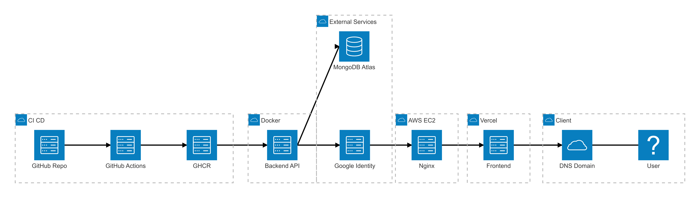
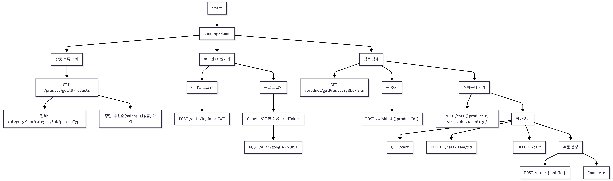
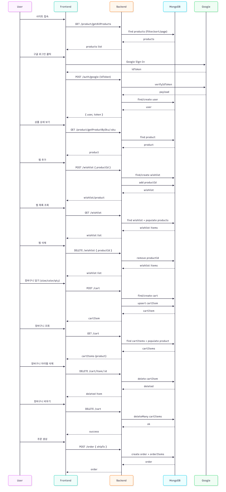

# nodeShop FE

Personal shopping mall frontend built with React and Vite. Focused on clean product browsing and core commerce flows.

## Features

- Category browsing for men, women, kids, and new arrivals
- Product detail pages with deep links by SKU
- Cart flow and order page
- Wishlist management
- Login page and layout with global navbar/footer
  
## Diagrams





## Tech Stack

- React 19 + TypeScript
- Vite
- React Router
- TanStack Query
- Tailwind CSS
- Axios

## Getting Started

```bash
npm install
npm run dev
```

### Scripts

- `npm run dev` - start local dev server
- `npm run build` - production build
- `npm run preview` - preview production build
- `npm run lint` - lint project

## Deployment

- https://shopping-mall-fe-bay.vercel.app


